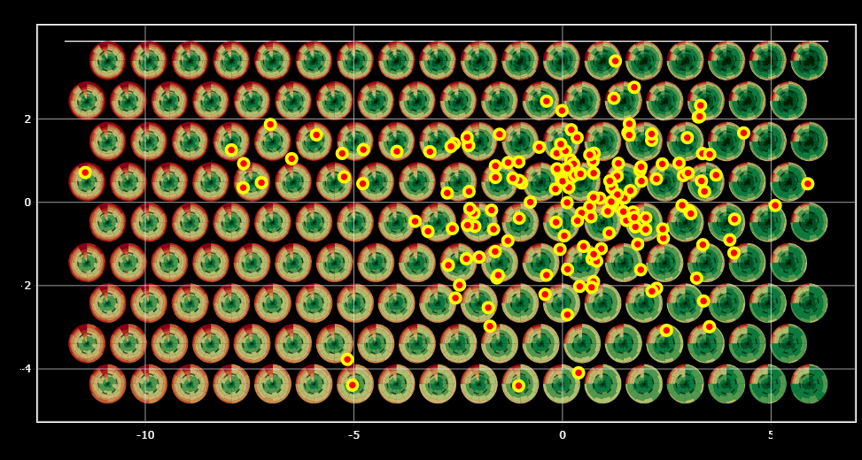

```{r setup, include=FALSE}
library(rgl)
library(car)
library(stringr)
knitr::opts_chunk$set(echo = TRUE,cache = F,message=F, warning = F)
knitr::knit_hooks$set(webgl = hook_webgl)

#some analysis
load("../Data/My_table3.RData")
library(tidyverse)
library(patchwork)
library(ggimg)
library(ggrepel)
library(ggforce)

getwd()
propath="C:/Users/anton/Il mio Drive/CROCETTA CUSTOMER/"
source(paste0(propath,"R_code/WASS_funct_discrete.R"))
source(paste0(propath,"R_code/WASS_funct_regression.R"))
source(paste0(propath,"R_code/WASS_principal_components_discr.R"))
source(paste0(propath,"R_code/WASS_viz_discrete.R"))
source(paste0(propath,"R_code/compute_moments.R"))
#Accorciamo le labels
#aggiungere a fin tibble L1 e L2 per poi fare le analisi

labs<-Fin_tibble$LAB
labs<-gsub("BARI.","BA.",labs)
labs<-gsub("BRINDISI.","BR.",labs)
labs<-gsub("2015.","15.",labs)
labs<-gsub("2016.","16.",labs)
labs<-gsub("2017.","17.",labs)
labs<-gsub("ROMA.","RM.",labs)
labs<-gsub("MILANO.","MI.",labs)
labs<-gsub("OTH_NAZ.","NAT.",labs)
labs<-gsub("INTERN.","IN.",labs)
labs<-gsub("ALITALIA.","AZ.",labs)
labs<-gsub("RYANAIR.","RY.",labs)
labs<-gsub("OTHER.","OT.",labs)
labs<-gsub(".Business",".Bu",labs)
labs<-gsub(".Leisure",".Le",labs)
labs<-gsub("INV.","W.",labs)
labs<-gsub("EST.","S.",labs)


basics<-m_sd_skew_NestTibb_nol(Fin_tibble[,2:15])

# connect rows by time
categ<-everything %>% select(AIRPORT,YEAR,SEASON,FLIGHT,COMPANY,TYPE)
categ<-categ %>% mutate(SEA_YEAR=paste0(SEASON,"_",YEAR),
                        allcat=factor(paste0(AIRPORT,"_",FLIGHT,"_",COMPANY,"_",TYPE)))
categ<-categ %>% mutate(SY=factor(SEA_YEAR,levels=c("EST_2015","INV_2015",
                                                    "EST_2016","INV_2016",
                                                    "EST_2017","INV_2017")))
levels(categ$SY)<-list(S_15="EST_2015",W_15="INV_2015",
                                                S_16="EST_2016",W_16="INV_2016",
                                               S_17="EST_2017",W_17="INV_2017")
```

## Preferences

### The data

```{r}
DATA<-Fin_tibble[,2:13]
means_of_v<-list()
means_of_v_d<-list()
for(i in 1:12){
  tmp<-mean_bargraph(DATA[,i])
  means_of_v[[i]]<-tmp
  means_of_v_d[[i]]<-Discretize_a_distr(tmp)
}
#create a single DF
x<-fre<-numeric()
v<-character()
for(i in 1:12){
  x<-c(x,means_of_v_d[[i]]$x)
  fre<-c(fre,means_of_v_d[[i]]$freq)
  v<-c(v,rep(names(DATA)[i],nrow(means_of_v_d[[i]])))
}

tmp_DF<-data.frame(x=x,freq=fre,v=factor(v,levels=names(DATA)))

p_means<-ggplot(tmp_DF,aes(x=x,y=freq))+geom_bar(stat="identity")+facet_grid(rows=vars(v))

p_means+theme_minimal()+ scale_x_discrete(limits=c(1:10),breaks=c(1:10))+scale_y_continuous(limits=c(0,0.32),breaks = c(0,0.30))+ylab("Rel.frequency")+xlab("Rating")+
    theme(strip.text.y.right=element_text(angle = 0))

```

```{r}

cov_mat <-cov_mat_Wass_discr(DATA)
```

```{r}
#basic statistics
Vars<-names(DATA)
VARIANCES<-unname(diag(cov_mat))
stds<-round(sqrt(VARIANCES),3)
VARIANCES<-round(VARIANCES,3)
WM_means<-WM_stds<-WM_skew<-numeric()
for (i in 1:12){
  WM_means<-c(WM_means,sum(means_of_v_d[[i]]$freq*means_of_v_d[[i]]$x))
  WM_stds<-c(WM_stds,
             sqrt(sum(means_of_v_d[[i]]$freq*means_of_v_d[[i]]$x^2)-WM_means[i]^2)
             )
  v<-sum(((means_of_v_d[[i]]$x-WM_means[i])/WM_stds[i])^3*means_of_v_d[[i]]$freq)
  WM_skew<-c(WM_skew, sign(v)*abs(v)^(1/3))
}

tmp_DF2<-data.frame(Var=Vars,Wass_Var=VARIANCES, Wass_Std=stds, 
                    Means=round(WM_means,3),Stds=round(WM_stds,3),Skew=round(WM_skew,3))

```


#### Wasserstein Variance, Covariance and correlation matrix

```{r}
colnames(cov_mat)<-names(DATA)
rownames(cov_mat)<-names(DATA)

new_mat<-cov_mat
for(i in 1:11){
  for (j in (i+1):12){
    new_mat[i,j]<-new_mat[i,j]/sqrt(new_mat[i,i]*new_mat[j,j])
  }
}
round(new_mat,3)
colnames(new_mat)<-names(DATA)
rownames(new_mat)<-names(DATA)

new_mat<-matrix(as.character(round(new_mat,3)),12,12)
colnames(new_mat)<-names(DATA)
rownames(new_mat)<-names(DATA)

#cov_mat
for(i in 1:12){
  new_mat[i,i]<- paste0("\\textbf{",new_mat[i,i], "}")
}

for(i in 1:11){
  for (j in (i+1):12){
    new_mat[j,i]<-paste0("\\textit{",new_mat[j,i], "}")
  }
}
#new_mat
#xtable(new_mat,sanitize.text.function = identity)
```


```{r PCAs}
#farei una PCA/interpreterei gli assi
quantiles=25
res<-WH.MultiplePCA_discr(Fin_tibble,list.of.vars = c(2:13),quantiles = quantiles,ncp_in = 8)
head(res$eig,n = 15)

```

## Expected vs perceived quality

```{r PCA_L1_L2s}
resL12<-WH.MultiplePCA_discr(Fin_tibble,list.of.vars = c(14:15),quantiles = 20,ncp_in = 5)
head(resL12$eig)
```

## EYE-iris plots

Eye-iris plot is a polar plot for showing the stacked percentage barcharts of the ratings assigned to a set of items.

### How to read

The dashed line represents the 50/% of preferences. The more the Eye-Iris is dominated by the green the more the rating is high.

Problems: low and medium-low rating frequencies are over-represented (perceptually, the plot is more sensitive to low ratings).

#### Performance plots of the first factorial plane of items

```{r VIZ1}
### EYE-iris plots
## 126 and 142 the farthest
Performance_plot(Fin_tibble[,2:13],selected = 91,labels=labs)+
  Performance_plot(Fin_tibble[,2:13],selected = 92,labels=labs)+
  Performance_plot(Fin_tibble[,2:13],selected = 14,labels=labs)+
  Performance_plot(Fin_tibble[,2:13],selected = 142,labels=labs)+
  Performance_plot(Fin_tibble[,2:13],selected = 5,labels=labs)+
  Performance_plot(Fin_tibble[,2:13],selected = 126,labels=labs)+
    Performance_plot(Fin_tibble[,2:13],selected = 162,labels=labs)+
  Performance_plot(Fin_tibble[,2:13],selected = 133,labels=labs)+
    Performance_plot(Fin_tibble[,2:13],selected = 79,labels=labs)
```
## The Spanish fan plots


```{r}
res2<-res
newnames <- str_replace(rownames(res2$quanti.var$coord),pattern = "[.]Q[(]0.52[)]",replacement = " Median")
newnames <- str_replace(newnames,pattern = "[.]Q[(]\\d[.]\\d+[)]",replacement = "")
newnames <- str_replace(newnames,pattern = "[.]",replacement = " ")
newnames <- substring(newnames, 3)
rownames(res2$quanti.var$cor) <- newnames
rownames(res2$global.pca$var$coord) <- newnames
p1 <- WH.plot_multiple_Spanish.funs_2(res2,var = 1,multi = T,corplot = T)+xlim(c(-1,1))+ylim(c(-1,1))+ggtitle(names(Fin_tibble[2:13])[1])+theme_void()+theme(legend.position = "none")
p2 <- WH.plot_multiple_Spanish.funs_2(res2,var = 2,multi = T,corplot = T)+xlim(c(-1,1))+ylim(c(-1,1))+ggtitle(names(Fin_tibble[2:13])[2])+theme_void()+theme(legend.position = "none")
p3 <- WH.plot_multiple_Spanish.funs_2(res2,var = 3,multi = T,corplot = T)+xlim(c(-1,1))+ylim(c(-1,1))+ggtitle(names(Fin_tibble[2:13])[3])+theme_void()+theme(legend.position = "none")
p4 <- WH.plot_multiple_Spanish.funs_2(res2,var = 4,multi = T,corplot = T)+xlim(c(-1,1))+ylim(c(-1,1))+ggtitle(names(Fin_tibble[2:13])[4])+theme_void()+theme(legend.position = "none")
p5 <- WH.plot_multiple_Spanish.funs_2(res2,var = 5,multi = T,corplot = T)+xlim(c(-1,1))+ylim(c(-1,1))+ggtitle(names(Fin_tibble[2:13])[5])+theme_void()+theme(legend.position = "none")
p6 <- WH.plot_multiple_Spanish.funs_2(res2,var = 6,multi = T,corplot = T)+xlim(c(-1,1))+ylim(c(-1,1))+ggtitle(names(Fin_tibble[2:13])[6])+theme_void()+theme(legend.position = "none")
p7 <- WH.plot_multiple_Spanish.funs_2(res2,var = 7,multi = T,corplot = T)+xlim(c(-1,1))+ylim(c(-1,1))+ggtitle(names(Fin_tibble[2:13])[7])+theme_void()+theme(legend.position = "none")
p8 <- WH.plot_multiple_Spanish.funs_2(res2,var = 8,multi = T,corplot = T)+xlim(c(-1,1))+ylim(c(-1,1))+ggtitle(names(Fin_tibble[2:13])[8])+theme_void()+theme(legend.position = "none")
p9 <- WH.plot_multiple_Spanish.funs_2(res2,var = 9,multi = T,corplot = T)+xlim(c(-1,1))+ylim(c(-1,1))+ggtitle(names(Fin_tibble[2:13])[9])+theme_void()+theme(legend.position = "none")
p10 <- WH.plot_multiple_Spanish.funs_2(res2,var = 10,multi = T,corplot = T)+xlim(c(-1,1))+ylim(c(-1,1))+ggtitle(names(Fin_tibble[2:13])[10])+theme_void()+theme(legend.position = "none")
p11 <- WH.plot_multiple_Spanish.funs_2(res2,var = 11,multi = T,corplot = T)+xlim(c(-1,1))+ylim(c(-1,1))+ggtitle(names(Fin_tibble[2:13])[11])+theme_void()+theme(legend.position = "none")
p12 <- WH.plot_multiple_Spanish.funs_2(res2,var = 12,multi = T,corplot = T)+xlim(c(-1,1))+ylim(c(-1,1))+ggtitle(names(Fin_tibble[2:13])[12])+theme_void()+theme(legend.position = "none")

p1+p2+p3+p4+p5+p6+p7+p8+p9+p10+p11+p12

```


## CRONBACh alpha

```{r}
alpha_stats<-Cronbach_discr(Fin_tibble[,c(2:13)])

mat_m<-matrix(0,ncol(alpha_stats$STATS$means),2)
mat_s<-matrix(0,ncol(alpha_stats$STATS$stds),2)
mat_sk<-matrix(0,ncol(alpha_stats$STATS$skew),2)

for(dims in 1:2){
  for (j in 1:ncol(alpha_stats$STATS$means)){
    mat_m[j,dims] <- cor(res$ind$coord[,dims],alpha_stats$STATS$means[,j])
    mat_s[j,dims] <- cor(res$ind$coord[,dims],alpha_stats$STATS$stds[,j])
    mat_sk[j,dims] <- cor(res$ind$coord[,dims],alpha_stats$STATS$skew[,j])
  }
}
colnames(mat_m)<-colnames(mat_s)<-colnames(mat_sk)<-c("Dim.1", "Dim.2")
rownames(mat_m)<-rownames(mat_s)<-rownames(mat_sk)<-names(Fin_tibble[,2:13])
```


```{r}
tmp_df<-data.frame(mat_m) %>% tibble::rownames_to_column() %>% mutate(inix=0,iniy=0)
options(ggrepel.max.overlaps = Inf)
pp1<-ggplot(tmp_df)+
  geom_segment(aes(x=inix,y=iniy,xend=Dim.1,yend=Dim.2), arrow = arrow(length = unit(0.05, "inches")))+
  geom_text_repel(aes(x=Dim.1,y=Dim.2,label=rowname))+
  geom_hline(yintercept = 0)+geom_vline(xintercept = 0)+
  geom_circle(aes(x0=0,y0=0,r=1),linetype = "dashed")+coord_fixed()+
  theme_bw()+
  xlab("Dim. 1 (34.4%)")+ylab("Dim. 2 (9.4%)")+
  ggtitle("Correlation of means w.r.t. the dimensions")+
  theme(plot.title=element_text(hjust=0.5))

tmp_df<-data.frame(mat_s) %>% tibble::rownames_to_column() %>% mutate(inix=0,iniy=0)
pp2<-ggplot(tmp_df)+
  geom_segment(aes(x=inix,y=iniy,xend=Dim.1,yend=Dim.2), arrow = arrow(length = unit(0.05, "inches")))+
  geom_text_repel(aes(x=Dim.1,y=Dim.2,label=rowname))+
  geom_hline(yintercept = 0)+geom_vline(xintercept = 0)+
  geom_circle(aes(x0=0,y0=0,r=1),linetype = "dashed")+coord_fixed()+
  theme_bw()+
  xlab("Dim. 1 (34.4%)")+ylab("Dim. 2 (9.4%)")+
  ggtitle("Correlation of st. devs. w.r.t. the dimensions")+
  theme(plot.title=element_text(hjust=0.5))

tmp_df<-data.frame(mat_sk) %>% tibble::rownames_to_column() %>% mutate(inix=0,iniy=0)
pp3<-ggplot(tmp_df)+
  geom_segment(aes(x=inix,y=iniy,xend=Dim.1,yend=Dim.2), arrow = arrow(length = unit(0.05, "inches")))+
  geom_text_repel(aes(x=Dim.1,y=Dim.2,label=rowname))+
  geom_hline(yintercept = 0)+geom_vline(xintercept = 0)+
  geom_circle(aes(x0=0,y0=0,r=1),linetype = "dashed")+coord_fixed()+
  theme_bw()+
  xlab("Dim. 1 (34.4%)")+ylab("Dim. 2 (9.4%)")+
  ggtitle("Correlation of skewness indices w.r.t. the dimensions")+
  theme(plot.title=element_text(hjust=0.5))
  

```


# Plotterei gli EYE-iris al posto dei punti sui piani fattoriali

```{r create_plots_and_save, message=FALSE, warning=FALSE}
 nn<-nrow(Fin_tibble)

for(i in 1:nn){
  fname<-paste0("./Images/im_",i,".png")
  pp<-Performance_plot(Fin_tibble[,2:13],selected = i,labels=labs)
    
#CairoPNG(filename = fname, bg = "transparent")
ggsave(filename = fname,
       plot = pp,
       width = 3, 
       height = 3,
       dpi=100#,bg='transparent'
      )
}

 df_im<-data.frame(ID=c(1:nn)) %>% mutate(adr=paste0("./Images/im_",ID,".png"))
```

### The green-eye-plots on the map

```{r message=FALSE, warning=FALSE,cache=TRUE}
sel_points<-which(rowSums(round(res$ind$cos2[,1:2],3))>0.6)
df<-as.data.frame(res$ind$coord)
df<-cbind(df,df_im)
df<-cbind(df,allcat=categ$allcat,SY=categ$SY)
df$labels<-Fin_tibble$LAB
p<-ggplot(df,aes(x=.data[[names(df)[1]]], 
              y=.data[[names(df)[2]]]))+
  #geom_point()+
  #geom_text(aes(label=ID))+
  geom_point_img(aes(
    x = .data[[names(df)[1]]],
    y = .data[[names(df)[2]]],
    img = adr
  ), size = 1.2,alpha=0.6)+
  theme_minimal()

```


```{r message=FALSE, warning=FALSE,cache=TRUE}
#p

p2<-ggplot(df[sel_points,],aes(x=.data[[names(df)[1]]], 
              y=.data[[names(df)[2]]]))+
  #geom_point()+
  #geom_text(aes(label=ID))+
  geom_point_img(aes(
    x = .data[[names(df)[1]]],
    y = .data[[names(df)[2]]],
    img = adr
  ), size = 1.2,alpha=0.6)+
  geom_point(data=df[-sel_points,],aes(x=.data[[names(df)[1]]], 
              y=.data[[names(df)[2]]]))+
  theme_minimal()
p2
```


```{r message=FALSE, warning=FALSE,cache=TRUE}
p2+geom_hline(yintercept = 0)+geom_vline(xintercept=0)+theme_minimal()+xlab("Dim. 1 (34.4%)")+ylab("Dim. 2 (9.4%)")+ggtitle("First factor plane. Expl. inertia (43.8%)")
```

## A plot with background eyes



## Scores of individuals in the first two dimensions

```{r scores_12}
scores<-data.frame(res$ind$coord[,1:2])
scores$Dim.1<-scores$Dim.1/sqrt(res$eig[1,1])
scores$Dim.2<-scores$Dim.2/sqrt(res$eig[2,1])
scores$rank1<-rank(-scores$Dim.1)
scores$rank2<-rank(scores$Dim.2)
scores$labels<-labs
sc_1<-ggplot(scores)+geom_density(aes(Dim.1),fill="grey70",alpha=0.2)+
  stat_function(fun = dnorm, args = list(mean = mean(scores$Dim.1), sd = sd(scores$Dim.1)),linetype = "dashed")+theme_bw()+labs(title="Scores distribution on Dim.1")+xlab("Score on Dim. 1")+ylab("density")+theme(plot.title=element_text(hjust=0.5))
sc_2<-ggplot(scores)+geom_density(aes(Dim.2),fill="grey70",alpha=0.2)+
  stat_function(fun = dnorm, args = list(mean = mean(scores$Dim.2), sd = sd(scores$Dim.2)),linetype = "dashed")+theme_bw()+labs(title="Scores distribution on Dim.2")+xlab("Score on Dim. 2")+ylab("density")+
  theme(plot.title=element_text(hjust=0.5))
# plot(density(scores$Dim.1))
# plot(density(scores$Dim.2))
sc_1
sc_2

```
cc


### a tentative with trajectories (longitudinal)

```{r}
scores$allcat<-df$allcat
scores$SY<-df$SY
tmp<-scores %>% group_by(SY) %>% mutate(r1 = rank(rank1),r2 = rank(rank2))
tmp$NN<-sapply(tmp$allcat,FUN = function(x) sum(x == tmp$allcat))

```
```{r}
library(ggbump)
airport<-"BARI"
motivation<-"Leisure"
plot_bb_r1<-function(airport,motivation,tmp){
tmpdf<-tmp %>% filter(grepl(motivation,allcat),grepl(airport,allcat),NN==6) %>% 
  mutate(label=gsub(pattern=paste0(airport,"_"),replacement="",allcat),
         label=gsub(pattern=paste0("_",motivation),replacement="",label),
         label_left=paste0(label,"  ",r1,"  "),label_right=paste0("  ",r1,"  ",label))
gb_1<-ggplot(tmpdf, aes(x=SY, y=r1, color = label,group=label)) +
  geom_point(size = 3)+
  geom_bump(size=2,smooth = 8)+
  geom_text(data = tmpdf %>% filter(SY=="S_15"),
            aes(x = SY  , label = label_left), size = 3, hjust = 1)+
    geom_text(data = tmpdf %>% filter(SY=="W_17"),
            aes(x = SY , label = label_right), size = 3, hjust = 0)+
   scale_x_discrete(expand = expansion(add = 2))+ 
   theme_void()+
  theme(legend.position = "none",
        panel.grid.major = element_blank()) +
  scale_y_reverse()+ggtitle(paste0(motivation," ",airport))
}
plot_bb_r2<-function(airport,motivation,tmp){
tmpdf<-tmp %>% filter(grepl(motivation,allcat),grepl(airport,allcat),NN==6) %>% 
  mutate(label=gsub(pattern=paste0(airport,"_"),replacement="",allcat),
         label=gsub(pattern=paste0("_",motivation),replacement="",label),
         label_left=paste0(label,"  ",r2,"  "),label_right=paste0("  ",r2,"  ",label))
gb_1<-ggplot(tmpdf, aes(x=SY, y=r2, color = label,group=label)) +
  geom_point(size = 3)+
  geom_bump(size=2,smooth = 8)+
  geom_text(data = tmpdf %>% filter(SY=="S_15"),
            aes(x = SY  , label = label_left), size = 3, hjust = 1)+
    geom_text(data = tmpdf %>% filter(SY=="W_17"),
            aes(x = SY , label = label_right), size = 3, hjust = 0)+
   scale_x_discrete(expand = expansion(add = 2))+ 
   theme_void()+
  theme(legend.position = "none",
        panel.grid.major = element_blank()) +
  scale_y_reverse()+ggtitle(paste0(motivation," ",airport))
}
```

### First dimension Bumping plots

```{r}
show(plot_bb_r1("BARI","Leisure",tmp))
show(plot_bb_r1("BARI","Business",tmp))
show(plot_bb_r1("BRINDISI","Leisure",tmp))
show(plot_bb_r1("BRINDISI","Business",tmp))
```

### Second dimension Bumping plots

```{r}
show(plot_bb_r2("BARI","Leisure",tmp))
show(plot_bb_r2("BARI","Business",tmp))
show(plot_bb_r2("BRINDISI","Leisure",tmp))
show(plot_bb_r2("BRINDISI","Business",tmp))

```


```{r warning=FALSE}

library(plotly)
ggplotly(ggplot(df,aes(x=.data[[names(df)[1]]], 
              y=.data[[names(df)[2]]],color=allcat))+geom_path(show.legend = F)+
           geom_text(aes(label=SY)))

ggplotly(ggplot(df,aes(x=.data[[names(df)[1]]], 
              y=.data[[names(df)[2]]],color=SY))+geom_point(show.legend = F,aes(text=allcat,text2=c(1:nrow(df))))
           )
```

### 3D plots

```{r 3d_plots, warning=FALSE}


fig <- plot_ly(df, x = ~Dim.1, y = ~Dim.2, z = ~Dim.3, color = ~allcat,size=1,
               hoverinfo = 'text',
               text = ~paste('Cat:', allcat, '<br>Sea:', SY))
fig <- fig %>% add_markers()
fig <- fig %>% layout(scene = list(xaxis = list(title = 'Dim.1'),
                     yaxis = list(title = 'Dim.2'),
                     zaxis = list(title = 'Dim.3')))

fig
```

## Time series

```{r}

# df_ts<-df %>% select(adr, allcat,SY) %>% pivot_wider(names_from = SY,values_from = adr,values_fill = NA)
# PATH="Images/im_2.png"
# df_ts$E_15[1]<-paste0("</img>")
# df_ts$E_15[2]<-paste0("</img>")
df_3<-df %>% filter(grepl("BARI",allcat))%>%filter(grepl("Leisure",allcat))%>%  select(adr, allcat,SY)
p2<-ggplot(df_3,aes(x=SY, 
              y=allcat))+
  #geom_point()+
  #geom_text(aes(label=ID))+
  geom_point_img(aes(
    x = SY,
    y = allcat,
    img = adr
  ), size = 3.5,alpha=0.6)+coord_fixed(ratio=1)+
  theme_minimal()+ggtitle("BARI Leisure")+xlab("")+ylab("")
p2

df_3<-df %>% filter(grepl("BARI",allcat))%>%filter(grepl("Business",allcat))%>%  select(adr, allcat,SY)
p2<-ggplot(df_3,aes(x=SY, 
              y=allcat))+
  #geom_point()+
  #geom_text(aes(label=ID))+
  geom_point_img(aes(
    x = SY,
    y = allcat,
    img = adr
  ), size = 3.5,alpha=0.6)+coord_fixed(ratio=1)+
  theme_minimal()+ggtitle("BARI Business")+xlab("")+ylab("")
p2


df_4<-df %>% filter(grepl("BRINDISI",allcat))%>% filter(grepl("Leisure",allcat))%>% select(adr, allcat,SY)
p3<-ggplot(df_4,aes(x=SY, 
              y=allcat))+
  #geom_point()+
  #geom_text(aes(label=ID))+
  geom_point_img(aes(
    x = SY,
    y = allcat,
    img = adr
  ), size = 3.5,alpha=0.6)+coord_fixed(ratio=1)+
  theme_minimal()+ggtitle("BRINDISI Leisure")+xlab("")+ylab("")
p3

df_4<-df %>% filter(grepl("BRINDISI",allcat))%>% filter(grepl("Business",allcat))%>% select(adr, allcat,SY)
p3<-ggplot(df_4,aes(x=SY, 
              y=allcat))+
  #geom_point()+
  #geom_text(aes(label=ID))+
  geom_point_img(aes(
    x = SY,
    y = allcat,
    img = adr
  ), size = 3.5,alpha=0.6)+coord_fixed(ratio=1)+
  theme_minimal()+ggtitle("BRINDISI Business")+xlab("")+ylab("")
p3

```

# Estrai gli scores dalle due PC

## Scree plot

```{r}
theme_set(theme_bw(12))
eig_vals<-data.frame(PC=paste0("Comp. ",1:15),Eigenvalue=res$eig[1:15,1])
eig_vals$PC<-factor(eig_vals$PC,levels=paste0("Comp. ",1:15))
scree<- ggplot(eig_vals,aes(x=PC,y=Eigenvalue,group=1))+
  geom_point(size=2)+
  geom_line()+xlab("")+
  scale_x_discrete(guide = guide_axis(angle = 45))#+
 #  labs(title="Scree plot: MFA on centered data")
scree
```


## Plot of inertia

```{r}
round(res$eig[which(res$eig[,3]<81),],3)

```

```{r}
library(DT)
library(colorspace)
contr_1<-as.data.frame(round(res$quanti.var$contrib,4))

COS2_vars_1<-as.data.frame(round(res$quanti.var$cos2,4))
coord_1<-as.data.frame(round(res$quanti.var$coord,4))
correl_1<-as.data.frame(round(res$quanti.var$cor,4))

```

## Coordinates

```{r}
dt<-datatable(coord_1,  caption = 'Coordinates.',
              extensions = 'Scroller', options = list(
                pageLength = 15,
  deferRender = TRUE,
  scrollY = 600,
  scroller = TRUE
))

for (x in colnames(coord_1)) {
  
  #v <- full_seq(unique(COS2_coord_1[[x]]), .01)
  v<-seq(min(coord_1[[x]]), max(coord_1[[x]]), by = 0.01)
  #browser()
  
  cs <- diverging_hsv(length(v),
  h = c(180, 330) )
  l_cs<-length(cs)

  dt <- dt %>% 
    formatStyle(x, backgroundColor = styleInterval(v[1:(l_cs-1)], cs), fontSize = '80%')
}

dt 
 # brks <- quantile(COS2_coord_1$Dim.1, probs = seq(.05, .95, .05), na.rm = TRUE)
 # clrs <- round(seq(255, 40, length.out = length(brks) + 1), 0) %>%
 #   {paste0("rgb(255,", ., ",", ., ")")}
 # 
 # DT::datatable(COS2_coord_1)%>% formatStyle('Dim.1', backgroundColor = styleInterval(brks, clrs))
```

## Contributions

```{r}
dt<-datatable(contr_1,  caption = 'Contributes.',
              extensions = 'Scroller', options = list(
                pageLength = 15,
  deferRender = TRUE,
  scrollY = 600,
  scroller = TRUE
))

for (x in colnames(contr_1)) {
  
  #v <- full_seq(unique(COS2_coord_1[[x]]), .01)
  v<-seq(min(contr_1[[x]]), max(contr_1[[x]]), by = 0.5)
  #browser()
  
  cs <- diverging_hsv(length(v),
  h = c(180, 330) )
  l_cs<-length(cs)

  dt <- dt %>% 
    formatStyle(x, backgroundColor = styleInterval(v[1:(l_cs-1)], cs), fontSize = '80%')
}

dt 
```

## cos2

```{r}
dt<-datatable(COS2_vars_1,  caption = 'Squared cosines',
              extensions = 'Scroller', options = list(
                pageLength = 15,
  deferRender = TRUE,
  scrollY = 600,
  scroller = TRUE
))

for (x in colnames(COS2_vars_1)) {
  
  #v <- full_seq(unique(COS2_coord_1[[x]]), .01)
  v<-seq(min(COS2_vars_1[[x]]), max(COS2_vars_1[[x]]), by = 0.05)
  #browser()
  
   cs <- sequential_hcl(length(v),
                       c = c(100, NA, 30), l = c(55, 90), power = c(1.1, NA),
  h = c(15, 50),rev=T)
  l_cs<-length(cs)

  dt <- dt %>% 
    formatStyle(x, backgroundColor = styleInterval(v[1:(l_cs-1)], cs), fontSize = '80%')
}

dt 
```

## Corr

```{r}
dt<-datatable(correl_1,  caption = 'Correlations',
              extensions = 'Scroller', options = list(
                pageLength = 15,
  deferRender = TRUE,
  scrollY = 600,
  scroller = TRUE
))

for (x in colnames(correl_1)) {
  
  #v <- full_seq(unique(COS2_coord_1[[x]]), .01)
  v<-seq(min(correl_1[[x]]), max(correl_1[[x]]), by = 0.01)
  #browser()
  
  cs <- diverging_hsv(length(v),
  h = c(180, 330) )
  l_cs<-length(cs)

  dt <- dt %>% 
    formatStyle(x, backgroundColor = styleInterval(v[1:(l_cs-1)], cs), fontSize = '80%')
}

dt 
```

## Explanatory statistics for each variable

### Contributes of vars to the axes

```{r contr_of_vars}
# contr_1<-as.data.frame(round(res$quanti.var$contrib,4))
# COS2_vars_1<-as.data.frame(round(res$quanti.var$cos2,4))
# coord_1<-as.data.frame(round(res$quanti.var$coord,4))
# correl_1<-as.data.frame(round(res$quanti.var$cor,4))
vars<-nrow(contr_1)/(quantiles+1)
Contr_var_1<-matrix(0,vars,ncol(res$quanti.var$contrib))
tmp_rn<-character()
for (i in 1:vars){
  ini<-(i-1)*(quantiles+1)+1
  fin<-(i)*(quantiles+1)
  tmp_rn<-c(tmp_rn,sub(".Min", "", row.names(res$quanti.var$contrib)[ini]))
  for (j in 1:ncol(res$quanti.var$contrib)){
    
    Contr_var_1[i,j]<-round(sum(res$quanti.var$contrib[c(ini:fin),j]),2)
  }
  
  
}
row.names(Contr_var_1)<-tmp_rn
colnames(Contr_var_1)<-colnames(res$quanti.var$contrib)

dt<-datatable(Contr_var_1,  caption = 'Contr_vars',
              extensions = 'Scroller', options = list(
                pageLength = 15,
  deferRender = TRUE,
  scrollY = 300,
  scroller = TRUE
))
dt
```

## Plot dei coseni al quadrato (R2)

```{r}
# COS2_vars_1<-as.data.frame(round(res$quanti.var$cos2,4))
# COS2_vars_1
vars<-nrow(contr_1)/(quantiles+1)
tmp_rn<-character()
QUA<-rep(c(0:quantiles)/quantiles,vars)
for (i in 1:vars){
  ini<-(i-1)*(quantiles+1)+1
  fin<-(i)*(quantiles+1)
  tmp_rn<-c(tmp_rn,rep(sub(".Min", "", row.names(res$quanti.var$contrib)[ini]),quantiles+1))
  
}
COS2_vars_1$VARS<-factor(tmp_rn)
COS2_vars_1$QUA<-round(QUA,3)
COS2_vars_1_pv<-pivot_longer(COS2_vars_1,cols = -c(VARS,QUA))
ggplot(COS2_vars_1_pv, aes(x=QUA,y=value))+geom_bar(stat="identity",aes(fill=value))+facet_grid(rows=vars(VARS),cols=vars(name))+
  ggtitle("Plot of Cos2 of quantiles of variables")+theme_minimal()

```

## correlations

```{r}
# COS2_vars_1<-as.data.frame(round(res$quanti.var$cos2,4))
# COS2_vars_1
vars<-nrow(correl_1)/(quantiles+1)
tmp_rn<-character()
QUA<-rep(c(0:quantiles)/quantiles,vars)
for (i in 1:vars){
  ini<-(i-1)*(quantiles+1)+1
  fin<-(i)*(quantiles+1)
  tmp_rn<-c(tmp_rn,rep(sub(".Min", "", row.names(res$quanti.var$contrib)[ini]),quantiles+1))
  
}
correl_1$VARS<-factor(tmp_rn)
correl_1$QUA<-round(QUA,3)
correl_1_pv<-pivot_longer(correl_1,cols = -c(VARS,QUA))
ggplot(correl_1_pv, aes(x=QUA,y=value))+geom_bar(stat="identity",aes(fill=value))+facet_grid(rows=vars(VARS),cols=vars(name))+
  ggtitle("Plot of correl of quantiles of variables")+
  scale_fill_gradient2(low = "red",mid = "white",high = "darkgreen",midpoint = 0,limits=c(-1,1))+
  theme_minimal()
```

# Costruisci la frontiera e mettici i punti in base agli scores

To be done!!

```{r}
res_L1<-WH.1d.PCA_discr(Fin_tibble, var=14, quantiles = quantiles,plots = T)
```

```{r}
res_L2<-WH.1d.PCA_discr(Fin_tibble, var=15, quantiles = quantiles,plots = T)
```

```{r message=FALSE, warning=FALSE}
Scores_on_1_2_FACT<-res$ind$coord[,1:2]
Scores_on_1_2_L12<-resL12$ind$coord[,1:2]
Scores_on_1_2_L1<-res_L1$PCAout$ind$coord[,1]
Scores_on_1_2_L2<-res_L2$PCAout$ind$coord[,1]
ALL_1_2<-cbind(Scores_on_1_2_FACT,Scores_on_1_2_L1,Scores_on_1_2_L2)
colnames(ALL_1_2)<-c("Dim.1","Dim.2","L12.1","L12.2")
ggplotly(ggplot(as.data.frame(round(ALL_1_2,3)))+geom_point(aes(x=L12.1,y=Dim.1,text=c(1:nrow(ALL_1_2)))))
ggplotly(ggplot(as.data.frame(ALL_1_2))+geom_point(aes(x=L12.1,y=Dim.2,text=c(1:nrow(ALL_1_2)))))
ggplotly(ggplot(as.data.frame(ALL_1_2))+geom_point(aes(x=L12.2,y=Dim.1,text=c(1:nrow(ALL_1_2)))))
ggplotly(ggplot(as.data.frame(ALL_1_2))+geom_point(aes(x=L12.2,y=Dim.2,text=c(1:nrow(ALL_1_2)))))
```

```{r}
df<-as.data.frame(round(ALL_1_2,3))

fig <- plot_ly(df, x = ~Dim.1, y = ~Dim.2, z = ~L12.1, 
               marker=#list(size=5,color='red'),
               list(color=~L12.1, colorscale = c('#FFE1A1', '#683531'), showscale = TRUE,size=5),
               hoverinfo = 'text', 
               text = ~paste('ID:', c(1:nrow(df))))
fig <- fig %>% add_markers()
fig <- fig %>% layout(scene = list(xaxis = list(title = 'Dim.1'),
                     yaxis = list(title = 'Dim.2'),
                     zaxis = list(title = 'L1')))

fig
```

```{r, webgl=TRUE}


scatter3d(x = df$Dim.1, z = df$Dim.2, y = df$L12.1, 
          grid = T,surface=F)
```


# 
